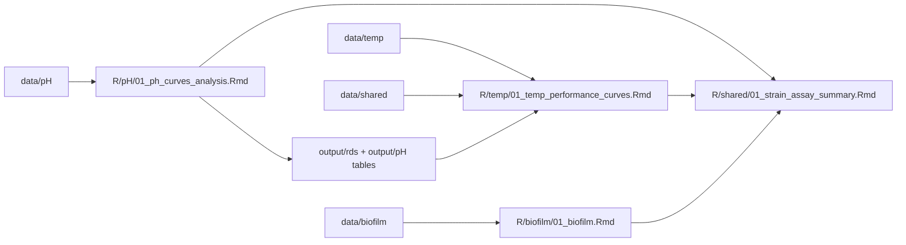

# Curtobacterium physiological assays

Reproducible analysis pipeline for three physiological assays on *Curtobacterium*
isolates: **pH**, **temperature**, and **biofilm**. From the committed input data,
the scripts here regenerate every figure, table, and report; no generated output is
tracked in the repository.

Open `curto_phys_assays.Rproj` in RStudio before running anything. All paths are
resolved with the [`here`](https://here.r-lib.org) package relative to the project
root, so the pipeline runs unchanged on a fresh clone.

## Repository layout

```
curto_phys_assays/
├── data/                     # committed input data (see "Data" below)
│   ├── pH/                   # GC_values_pHassay.*.txt (per-run growth values) + buffer recipes
│   ├── temp/                 # GC_values_Temp_assay.*.txt + plate maps
│   ├── biofilm/              # biofilmassay.xlsx (raw plate reads)
│   └── shared/               # cross-assay metadata: master metadata, clade colors, fastANI output
├── R/
│   ├── pH/
│   │   ├── 01_ph_curves_analysis.Rmd     # main pH analysis
│   │   ├── potassium_phosphate_buffer.R  # buffer-recipe helper
│   │   └── provenance/                   # how the pH GC_values were generated (needs raw data)
│   │       ├── gc_helpers.R                       # reusable functions for raw plate analysis
│   │       ├── report_sources/GC_template.Rmd     # consolidated raw-data template (sources gc_helpers.R)
│   │       └── run_gc_template.R                  # sets strains/date/paths and renders GC_template.Rmd
│   ├── temp/
│   │   ├── 01_temp_performance_curves.Rmd # main temperature analysis
│   │   └── provenance/                    # how the temp GC_values were generated (needs raw data)
│   ├── biofilm/
│   │   └── 01_biofilm.Rmd
│   └── shared/
│       └── 01_strain_assay_summary.Rmd    # combines all three assays (run LAST)
├── docs/
│   ├── protocols/            # bench protocols (.docx, .pdf)
│   └── design/               # experiment-planning spreadsheets (strain selection, inoculation ODs)
├── output/                   # ALL generated figures/tables/reports (git-ignored, auto-created)
├── plots/                    # legacy output dir (git-ignored; some ggsave() paths still point here)
├── curto_phys_assays.Rproj
├── .gitignore
└── README.md
```

Scripts are numbered in run order within each folder. Every script creates its own
output subdirectories under `output/` (git-ignored) with
`dir.create(here("output/..."), recursive = TRUE, showWarnings = FALSE)`.

## Data

What ships in the repo is the **processed per-run growth values** and the shared
metadata needed to interpret them — not the bulky raw plate-reader files.

| Path | Contents | Role |
|------|----------|------|
| `data/pH/GC_values_pHassay.*.txt` | 45 per-run growth-rate/carrying-capacity tables | pipeline input |
| `data/pH/*.csv` | potassium-phosphate buffer recipes | reference |
| `data/temp/GC_values_Temp_assay.*.txt` | 4 per-run growth-value tables | pipeline input |
| `data/temp/plate_map_*.txt`, `*_PLATE_layout.txt` | plate layouts | provenance |
| `data/biofilm/biofilmassay.xlsx` | crystal-violet biofilm reads | pipeline input |
| `data/shared/master_md_all_sequenced_Isolates_with_extendedMD.txt` | strain metadata (clade/subclade) | shared input |
| `data/shared/clade_colors.txt` | clade/subclade color map | shared input |
| `data/shared/fastANI.out`, `fastANI.out.matrix` | genome ANI distances | shared input (temp only) |

**Raw plate-reader exports are not distributed.** The scripts in each `provenance/`
folder document how the committed `GC_values_*.txt` were produced from raw reads. To
re-run them, obtain the raw files (available on request) and place them under
`data-raw/pH/` and `data-raw/temp/` (both git-ignored); paths in those scripts already
point there.

For new pH plates, prefer the consolidated template: edit
`R/pH/provenance/run_gc_template.R` (strains, date, raw-file path, and any optional
corrections) and source it to render `report_sources/GC_template.Rmd`, which draws
its reusable functions from `provenance/gc_helpers.R`. The older per-run variant
scripts in `report_sources/` are kept for provenance.

## Setup

Open `curto_phys_assays.Rproj` in RStudio and install the packages listed under
**Dependencies** below (all from CRAN). Reports are R Markdown; render them in
RStudio (the **Knit** button) or with `rmarkdown::render()`.

## Reproducing the analysis

Because the summary and the temperature analysis depend on the pH analysis, run the
assays in this order:



1. **pH** — knit `R/pH/01_ph_curves_analysis.Rmd`.
   Reads `data/pH/GC_values_pHassay.*.txt` + `data/shared/`; writes figures to
   `output/pH/`, tables (`curve_params.tsv`, `pH_strain_table.txt`, …) to `output/pH/`,
   and two serialized plots to `output/rds/` that the temperature step consumes.
2. **temperature** — knit `R/temp/01_temp_performance_curves.Rmd`.
   Reads `data/temp/GC_values_Temp_assay.*.txt`, `data/shared/` (incl. fastANI), and the
   pH `.rds` files from `output/rds/`; writes to `output/temp/`. **Run step 1 first.**
3. **biofilm** — knit `R/biofilm/01_biofilm.Rmd` (independent of pH/temp).
   Reads `data/biofilm/biofilmassay.xlsx`; writes to `output/biofilm/`.
4. **summary** — knit `R/shared/01_strain_assay_summary.Rmd` **last**.
   Reads the per-assay tables from `output/pH/`, `output/temp/`, `output/biofilm/`;
   writes combined figures to `output/shared/`.

Deleting `output/` and re-running steps 1–4 in order reproduces everything from the
committed data.

For step-by-step run instructions (including how to render each report and how to
regenerate the `GC_values_*.txt` inputs from raw plate reads), see [`USAGE.md`](USAGE.md).

## Provenance: regenerating `GC_values_*.txt` from raw plate reads

The committed `GC_values_*.txt` files are already-processed per-run growth values.
The scripts in each `provenance/` folder document how they were produced from raw
plate-reader exports. **You only need this to add a new run or reprocess raw data** —
the standard pipeline above runs entirely from the committed inputs. Raw exports are
not distributed; obtain them on request and place them under `data-raw/pH/` or
`data-raw/temp/` (both git-ignored). Paths in the provenance scripts already point there.

### pH

Use the consolidated template: edit the settings in
`R/pH/provenance/run_gc_template.R` (strain names per plate row, `raw_file`, `date`,
and optional QC parameters) and source it. It renders
`R/pH/provenance/report_sources/GC_template.Rmd` (functions from
`R/pH/provenance/gc_helpers.R`) and writes `data/pH/GC_values_pHassay.<date>.txt`.
Older per-run `report_sources/*.Rmd` variants are kept for provenance only.

### Temperature

`R/temp/provenance/` holds one script per assay date. Each reads a raw plate-reader
export from `data-raw/temp/` plus its plate map from `data/temp/`, and writes
`data/temp/GC_values_Temp_assay.<date>.txt`. They share a common workflow but differ
in plate layout and a few date-specific corrections:

| Script | Assay date | Raw file (`data-raw/temp/`) | Plate map (`data/temp/`) | Layout | Date-specific handling |
|--------|-----------|-----------------------------|--------------------------|--------|------------------------|
| `temp_assay_analysis_011424.Rmd` | 2024-01-14 | `Clade1_temp_aasay.txt` | `plate_map_011424.txt` | 22 cols (11 pairs), rows A–L (88 wells) | blanks averaged at 13 h; 12 h read dropped; residual `NA`s set to 40 |
| `temp_assay_analysis_022024.Rmd` | 2024-02-20 | `022024_temp_aasay.txt` | `plate_map_022024.txt` | 24 cols (12 pairs), rows A–O (120 wells) | blanks averaged at 0 h; drops T=9 °C @ 45 h and T=4 °C @ 1–9 h |
| `temp_assay_analysis_031424.Rmd` | 2024-03-14 | `031324_temp_aasay.txt` | `plate_map_031424.txt` | 24 cols, rows A–O | fixes a temperature-label typo (140 → 40 °C) |
| `temp_assay_analysis_041524.Rmd` | 2024-04-15 | `temp_assay_041524.txt` | `isolates_for_4th_temp_assay_PLATE_layout.txt` | 24 cols, rows A–O | 4th assay; distinct isolate panel |

The shared per-date workflow is:

1. **Read & clean** the raw export with `readLines()`, dropping header/blank lines
   (`^600`, `^Plate ID`, empties), then parse the tab-separated body into
   `Plate_ID`, `Well_ID`, `Well`, `Value`.
2. **Parse conditions** out of `Plate_ID`: temperature (`T<n>`) and timepoint (`<n>h`).
3. **Map wells → strains** using the plate map, which is laid out in interleaved
   odd/even column blocks across row groups; repeated strain names get an automatic
   replicate index.
4. **Background-correct** by subtracting the per-temperature mean of the `NEG` blank
   wells (the reference timepoint differs by date — see the table).
5. **Fit growth curves** per well with `growthcurver::SummarizeGrowth()`
   (`bg_correct = "none"`, `t_trim = 0`); flag wells that cannot be fit, force
   `r = k = 0` when `k < 0.086`, and cap `k` at the observed `max.OD` when `k > 1`.
6. **QC plots**: observed vs. predicted OD per strain × temperature, and temperature
   performance curves (reaction norms) for growth rate `r` and carrying capacity `k`,
   colored by subclade (metadata joined from `data/shared/`).
7. **Export** the stacked per-temperature parameter table (tagged with `date`) to
   `data/temp/GC_values_Temp_assay.<date>.txt` — the naming the main temperature step
   picks up by pattern.

## Dependencies

Install these packages from CRAN, then open the `.Rproj`. Key packages: tidyverse
(dplyr, tidyr, readr, ggplot2, purrr, stringr, forcats, tibble), growthcurver, rTPC,
nls.multstart, here, broom, rstatix, multcompView, pracma, Hmisc, corrplot, GGally,
UpSetR, ggvenn, ggh4x, ggpubr, vegan, reshape2, tuple, lubridate, readxl, knitr,
rmarkdown.

The analysis was last run and validated under the following environment
(`sessionInfo()`):

```
R version 4.5.0 (2025-04-11)
Platform: aarch64-apple-darwin20
Running under: macOS 26.6.2

attached base packages:
[1] grid stats graphics grDevices utils datasets methods base

other attached packages:
 [1] rmarkdown_2.29      knitr_1.50          readxl_1.4.5        vegan_2.7-2
 [5] permute_0.9-7       ggpubr_0.6.0        pracma_2.4.4        multcompView_0.1-10
 [9] rstatix_0.7.2       GGally_2.4.0        corrplot_0.95       Hmisc_5.2-3
[13] ggvenn_0.1.10       UpSetR_1.4.0        ggh4x_0.3.1.9000    here_1.0.1
[17] broom_1.0.8         tuple_0.4-02        reshape2_1.4.4      nls.multstart_2.0.0
[21] rTPC_1.0.4          growthcurver_0.3.1  lubridate_1.9.4     forcats_1.0.0
[25] stringr_1.5.1       dplyr_1.1.4         purrr_1.0.4         readr_2.1.5
[29] tidyr_1.3.1         tibble_3.3.0        ggplot2_3.5.2       tidyverse_2.0.0
```

To regenerate this list on your machine, run `sessionInfo()` after loading the
packages above.

## Notes

- Filenames were normalized to lowercase-with-underscores and some typos corrected on
  the way in (`analisis`→`analysis`, `perfromance`→`performance`, `potasium`→`potassium`).
  Data filenames (e.g. `GC_values_*.txt`) were left unchanged because the scripts match
  them by pattern.
- `output/` and `data-raw/` are git-ignored; the committed inputs under `data/`, docs
  under `docs/`, and all scripts under `R/` are tracked.
- No generated output is tracked. A legacy `plots/` directory (a few `ggsave()` calls
  still write PNGs there instead of under `output/`), a stray `anova_pH_results.csv`,
  and timestamped `_test_backup/` snapshots are git-ignored and are **not** part of the
  tracked pipeline; the canonical output location is `output/`.
