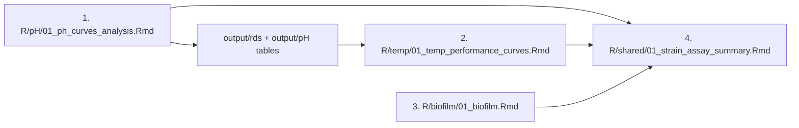

# Usage guide

How to run the analysis scripts for the *Curtobacterium* physiological assays
(**pH**, **temperature**, **biofilm**) and the cross-assay **summary**. For the
repository overview and data inventory, see [`README.md`](README.md).

All paths are resolved with [`here`](https://here.r-lib.org) relative to the project
root, so **open `curto_phys_assays.Rproj` first** and run everything from there — no
`setwd()` or absolute paths needed.

## Before you start

1. Open `curto_phys_assays.Rproj` in RStudio.
2. Install the packages listed under **Dependencies** in [`README.md`](README.md)
   (tidyverse, growthcurver, rTPC, nls.multstart, here, broom, rstatix, multcompView,
   readxl, rmarkdown, knitr, …). All are on CRAN.
3. Confirm the committed inputs are present under `data/` (they ship with the repo).

The scripts are R Markdown reports. Run each by opening it and clicking **Knit** in
RStudio, or with `rmarkdown::render()` from the console. Each script auto-creates its
output subdirectories under `output/` (git-ignored).

## The pipeline (run in this order)

Temperature and the summary depend on outputs from the pH step, so order matters.

### 1. pH — `R/pH/01_ph_curves_analysis.Rmd`

- **Reads:** `data/pH/GC_values_pHassay.*.txt` (all matched by pattern and stacked),
  `data/shared/master_md_all_sequenced_Isolates_with_extendedMD.txt`,
  `data/shared/clade_colors.txt`.
- **Writes:** figures and tables to `output/pH/` (e.g. `curve_params.tsv`,
  `pH_strain_table.txt`), and two serialized plots to `output/rds/` that the
  temperature step reads back.
- **Run this first** — steps 2 and 4 depend on its outputs.

### 2. Temperature — `R/temp/01_temp_performance_curves.Rmd`

- **Reads:** `data/temp/GC_values_Temp_assay.*.txt`, the two `data/shared/` metadata
  files, and the `.rds` plots from `output/rds/` produced by step 1.
- **Writes:** figures and tables to `output/temp/` (e.g. `temp_strain_table.txt`,
  `temp_curve_params_table.txt`).
- **Requires step 1 to have run** (it reads `output/rds/`).

### 3. Biofilm — `R/biofilm/01_biofilm.Rmd`

- **Reads:** `data/biofilm/biofilmassay.xlsx`, plus the two `data/shared/` metadata files.
- **Writes:** figures and tables to `output/biofilm/` (`biofilm_strain_table.txt`,
  `biofilm_avg_data.txt`).
- **Independent** of pH and temperature; can be run any time.

### 4. Summary — `R/shared/01_strain_assay_summary.Rmd`

- **Reads:** the per-assay tables written by steps 1–3 (`output/pH/`, `output/temp/`,
  `output/biofilm/`) plus the shared metadata.
- **Writes:** combined cross-assay figures to `output/shared/`.
- **Run last** — it consumes outputs from all three assays.

Deleting `output/` and re-running steps 1 → 4 reproduces every figure and table from
the committed data.

## Supporting helper

- `R/pH/potassium_phosphate_buffer.R` — fits the buffer-recipe regression from
  `data/pH/potassium_phosphate_ph_buffers.csv` and writes the predicted
  `pH_buffers*.csv` tables. A bench-prep utility; **not** required to reproduce the
  assay figures.

## Regenerating `GC_values_*.txt` from raw plate reads (provenance)

The committed `GC_values_*.txt` files are already-processed per-run growth values.
The `provenance/` folders document how they were produced from raw plate-reader
exports. **You only need this to add a new run or reprocess raw data** — the pipeline
above runs entirely from the committed inputs.

Raw exports are not distributed. Obtain them on request and place them under
`data-raw/pH/` or `data-raw/temp/` (both git-ignored); the provenance scripts already
point there.

### New pH plate (preferred workflow)

Edit and source `R/pH/provenance/run_gc_template.R`:

1. Set the 15 strain names (`S1`–`S15`, one per plate row A–O). Repeat a strain to
   encode in-plate replicates.
2. Set `raw_file` (path under `data-raw/pH/`) and `date` (`YYYY-MM-DD`).
3. Adjust the render `params` as needed:
   - `replicates` — `"auto"`, `"none"`, or an integer vector.
   - `blank_method` — `"match"` (by time + pH) or `"mean"`.
   - `drop_neg_ph` — pH levels whose blanks show growth, e.g. `c(6.2, 6.5)`.
   - `offset_wells` — wells to baseline-offset (e.g. condensation artifacts).
   - `problem_wells` — wells to force `r = k = 0`.
   - `high_k_action` — `"zero"` or `"rescue"` implausibly high `k`.
   - `blank_baseline` — background OD baseline (default `0.085`).
4. Source the file. It renders `R/pH/provenance/report_sources/GC_template.Rmd`
   (functions from `R/pH/provenance/gc_helpers.R`), writes a QC report to
   `output/reports/`, and writes `data/pH/GC_values_pHassay.<date>.txt`.

The template can also run standalone by editing the fallback values in its `config`
chunk. Older per-run `report_sources/*.Rmd` variants and the `run_file_96.R`,
`run_file_384.R`, and `merge_interrupted_datasets.R` scripts are kept for provenance
only.

### Temperature runs

`R/temp/provenance/` holds one script per assay date. Each reads a raw plate-reader
export from `data-raw/temp/` plus its plate map from `data/temp/`, and writes
`data/temp/GC_values_Temp_assay.<date>.txt`. They share a workflow but differ in plate
layout and a few date-specific corrections:

| Script | Assay date | Raw file (`data-raw/temp/`) | Plate map (`data/temp/`) | Layout | Date-specific handling |
|--------|-----------|-----------------------------|--------------------------|--------|------------------------|
| `temp_assay_analysis_011424.Rmd` | 2024-01-14 | `Clade1_temp_aasay.txt` | `plate_map_011424.txt` | 22 cols (11 pairs), rows A–L (88 wells) | blanks averaged at 13 h; 12 h read dropped; residual `NA`s set to 40 |
| `temp_assay_analysis_022024.Rmd` | 2024-02-20 | `022024_temp_aasay.txt` | `plate_map_022024.txt` | 24 cols (12 pairs), rows A–O (120 wells) | blanks averaged at 0 h; drops T=9 °C @ 45 h and T=4 °C @ 1–9 h |
| `temp_assay_analysis_031424.Rmd` | 2024-03-14 | `031324_temp_aasay.txt` | `plate_map_031424.txt` | 24 cols, rows A–O | fixes a temperature-label typo (140 → 40 °C) |
| `temp_assay_analysis_041524.Rmd` | 2024-04-15 | `temp_assay_041524.txt` | `isolates_for_4th_temp_assay_PLATE_layout.txt` | 24 cols, rows A–O | 4th assay; distinct isolate panel |

The shared per-date workflow is:

1. **Read & clean** the raw export with `readLines()`, dropping header/blank lines
   (`^600`, `^Plate ID`, empties), then parse the tab-separated body into
   `Plate_ID`, `Well_ID`, `Well`, `Value`.
2. **Parse conditions** out of `Plate_ID`: temperature (`T<n>`) and timepoint (`<n>h`).
3. **Map wells → strains** using the plate map (interleaved odd/even column blocks
   across row groups; repeated strain names get an automatic replicate index).
4. **Background-correct** by subtracting the per-temperature mean of the `NEG` blank
   wells (the reference timepoint differs by date — see the table).
5. **Fit growth curves** per well with `growthcurver::SummarizeGrowth()`
   (`bg_correct = "none"`, `t_trim = 0`); flag unfittable wells, force `r = k = 0`
   when `k < 0.086`, and cap `k` at the observed `max.OD` when `k > 1`.
6. **QC plots**: observed vs. predicted OD per strain × temperature, and temperature
   performance curves (reaction norms) for `r` and `k` by subclade.
7. **Export** the stacked per-temperature parameter table (tagged with `date`) to
   `data/temp/GC_values_Temp_assay.<date>.txt`.

To reprocess a date, edit the raw-file path / plate-map / `date` at the top of the
matching script and knit it.

## Notes

- Canonical outputs go to `output/` (git-ignored, auto-created). A legacy `plots/`
  directory still receives a few stray `ggsave()` PNGs, and a root
  `anova_pH_results.csv` is a stray artifact — neither is part of the tracked pipeline.
- Data filenames are matched by pattern; keep the
  `GC_values_pHassay.<date>.txt` / `GC_values_Temp_assay.<date>.txt` naming so new
  runs are picked up automatically.
